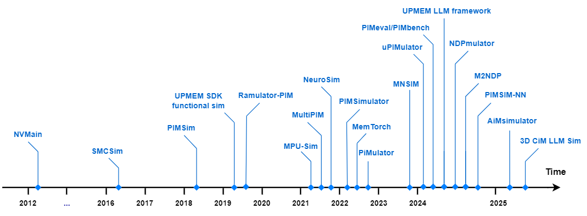

I am Saba Ebrahimi, a master's student in Computer Architecture at Shahid Beheshti University of Tehran, Iran under supervision of Dr. Dara Rahmati. 

Also, I am AI hardware R&D Engineer at Algonet, working on LLM inference on edge systems. My main research interests are AI hardware, embedded systems, computer architecture, memory systems and processing-in-memory (PIM), OS kernel, distributed systems and heterogeneous computing. 

My main goal is to find the most optimized inference solutions for the edge and resource-constraint systems. 

Publications
======

  
  

    
  NTSM: OS-Level Memory Middleware for Scaling AI Without Boundaries
     
    A. Noohi, M. Derispour*, <strong>S. Ebrahimi*</strong> and A. Barbalace, 
   <em>27th ACM/IFIP International Middleware Conference,</em> Universitat Rovira i Virgili - Spain, 2026.
    [<a href="https://www.research.ed.ac.uk/en/publications/ntsm-os-level-memory-middleware-for-scaling-ai-without-boundaries/" target="_blank">paper</a>]
  

  
  

    
      Modeling and Simulation Frameworks for Processing-in-Memory Architectures
    
    M. Aghaei*, <strong>S. Ebrahimi*</strong>, M. S. Arafati, E. Cheshmikhani, D. Rahmati, S. Gorgin and J. Kim,  
    <em>arXiv preprint arXiv:2512.00096</em>
    [<a href="https://arxiv.org/abs/2512.00096" target="_blank">paper</a>]
  

Education
======
1. Register a GitHub account if you don't have one and confirm your e-mail (required!)
1. Fork [this template](https://github.com/academicpages/academicpages.github.io) by clicking the "Use this template" button in the top right. 
1. Go to the repository's settings (rightmost item in the tabs that start with "Code", should be below "Unwatch"). Rename the repository "[your GitHub username].github.io", which will also be your website's URL.
1. Set site-wide configuration and create content & metadata (see below -- also see [this set of diffs](https://archive.is/3TPas) showing what files were changed to set up [an example site](https://getorg-testacct.github.io) for a user with the username "getorg-testacct")
1. Upload any files (like PDFs, .zip files, etc.) to the files/ directory. They will appear at https://[your GitHub username].github.io/files/example.pdf.  
1. Check status by going to the repository settings, in the "GitHub pages" section

